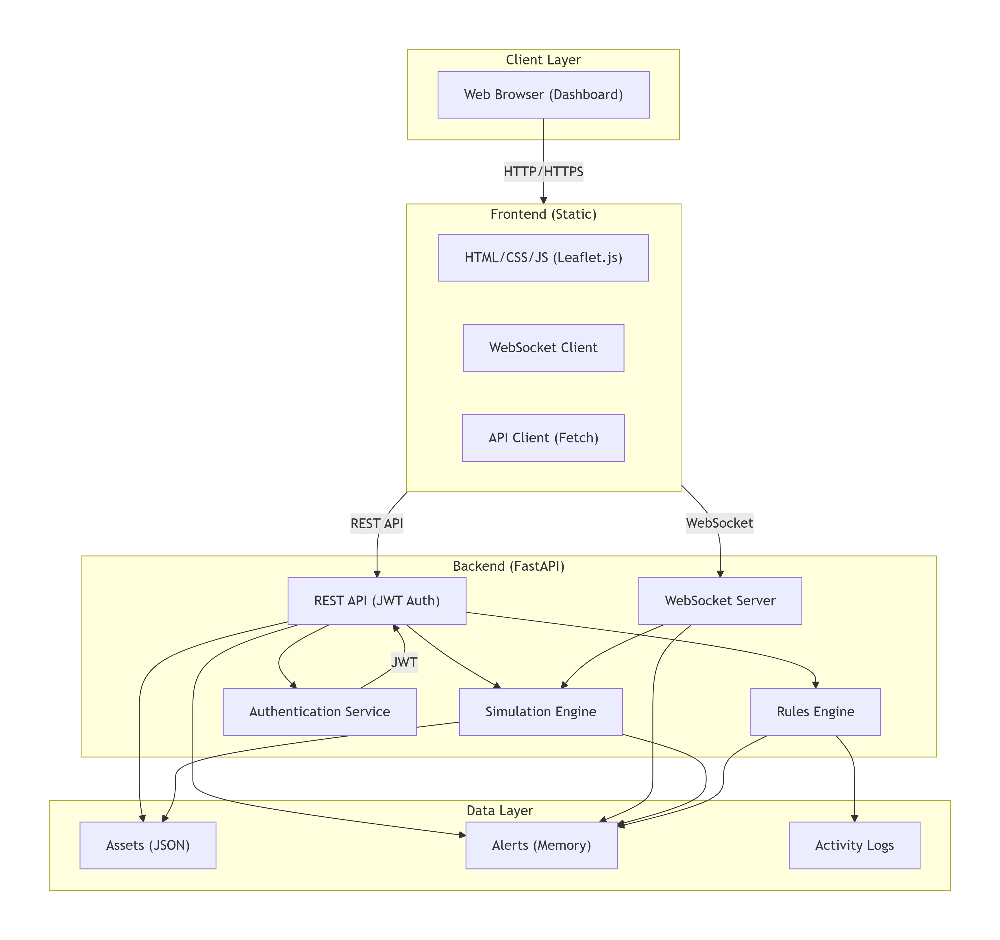
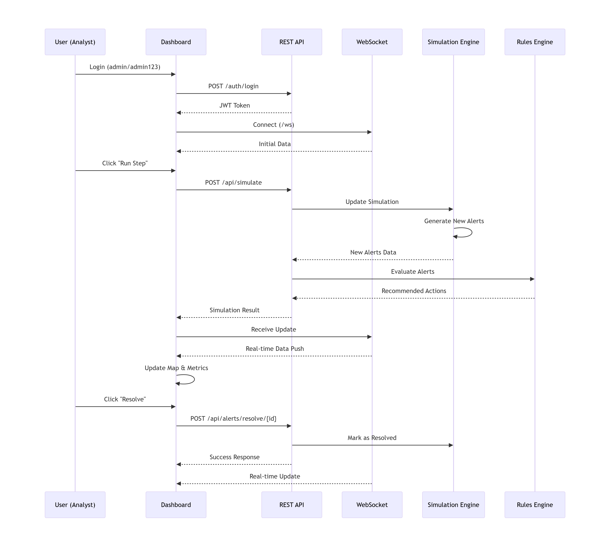

# 🛰️ Centinela - Critical Infrastructure Monitor

> **Your Living Laboratory for Security, Automation & Resilience**

Centinela is a fully functional, interactive **Proof of Concept (PoC)** that demonstrates how cybersecurity, automation and resilient architectures can be transformed into an operational platform for monitoring critical infrastructure.

---

# Overview

Centinela simulates a real-time monitoring and incident response platform where stakeholders can **evaluate security capabilities before implementation**.

It showcases:

- Security by Design
- Intelligent Automation
- Real-time Resilience
- Geospatial Monitoring
- WebSocket synchronization
- Rule-based decision engine

---

# What This Demo Proves

## Security in Action

| Concept | Implementation |
|----------|----------------|
| Robust Authentication | JWT Authentication + bcrypt password hashing + RBAC |
| Data Protection | HTTPS-ready architecture + CORS |
| Threat Detection | Rules Engine classifies Cyber & Natural Disaster alerts |
| Audit Trail | Every operation is logged |

## Automation

| Concept | Implementation |
|----------|----------------|
| Simulation Engine | Generates realistic infrastructure events |
| Automated Workflows | Auto Simulation mode |
| AI Ready | Rules Engine designed for predictive models |

## Resilience

| Concept | Implementation |
|----------|----------------|
| Decoupled Architecture | Independent frontend/backend |
| Real-time Communication | WebSockets |
| Human in the Loop | Manual alert resolution |

---

# System Architecture



---

# Sequence Diagram



---

# Quick Start

## Requirements

- Python 3.10+
- Git

## Installation

```bash
cd centinela-demo

cd backend
pip install -r requirements.txt
python app.py

cd ../frontend
python -m http.server 5500
```

Open:

- Dashboard → http://localhost:5500
- Swagger → http://localhost:8000/docs

---

# Demo Credentials

| User | Password | Role |
|------|----------|------|
| admin | admin123 | Administrator |
| analyst | analyst123 | Analyst |
| viewer | viewer123 | Viewer |

---

# Evaluation Script

## Validate Authentication

```bash
curl http://localhost:8000/api/assets
```

Expected:

```json
{"detail":"Not authenticated"}
```

Login:

```bash
curl -X POST http://localhost:8000/auth/login \
-H "Content-Type: application/json" \
-d '{"username":"viewer","password":"viewer123"}'
```

---

## Execute Simulation

```bash
curl -X POST http://localhost:8000/api/simulate \
-H "Authorization: Bearer <TOKEN>" \
-H "Content-Type: application/json" \
-d '{"scenario":"ciberataque","intensity":5}'
```

---

## Real-time Synchronization

1. Open two browser windows.
2. Login with different users.
3. Run simulation.
4. Observe WebSocket synchronization.

---

# Dashboard

## Metrics

- Assets Monitored
- Active Alerts
- Critical Assets
- Uptime

## Interactive Map

- Leaflet.js
- Live updates
- Asset popups
- Color status

## Control Panel

- Scenario selector
- Intensity (1-5)
- Manual simulation
- Auto simulation

## Alert Management

- Severity classification
- One-click resolution
- Activity logs

---

#  Technology Stack

| Component | Technology |
|-----------|------------|
| Backend | FastAPI |
| Auth | JWT + bcrypt |
| Realtime | WebSockets |
| Frontend | HTML/CSS/JavaScript |
| Maps | Leaflet.js |
| Icons | Font Awesome |
| Fonts | Inter |

---

# Project Structure

```text
centinela-demo/
├── backend/
│   ├── app.py
│   ├── auth.py
│   ├── models.py
│   ├── simulation.py
│   ├── rules_engine.py
│   ├── requirements.txt
│   └── data/
│       └── assets.json
├── frontend/
│   ├── index.html
│   ├── css/
│   └── js/
├── docs/
├── README.md
```

---

# Business Value

## CISOs

- Security posture visualization
- Incident lifecycle
- Compliance support

## Operations

- Automation
- Reduced response times
- Scalability

## Architects

- API First
- Modular architecture
- AI-ready

---

# Key Differentiators

| Feature | Centinela | Generic |
|---------|-----------|---------|
| JWT + RBAC | ✅ | ❌ |
| WebSockets | ✅ | ❌ |
| Simulation Engine | ✅ | ❌ |
| Rules Engine | ✅ | ❌ |
| Audit Trail | ✅ | ❌ |
| AI Ready | ✅ | ❌ |

---

# Author

**Aixa Benitez**

Strategic Technical Architect

---

# License

Educational and demonstration purposes.

---

# Why Centinela Matters

> **Security is not merely a policy—it is an architecture. Automation is not merely a tool—it is an operational capability. Resilience is not merely a goal—it is a design principle.**

Centinela transforms strategic vision into an interactive platform capable of demonstrating modern cyber-defense architectures in real time.

## "The technology we build today defines the democracy we will have tomorrow."